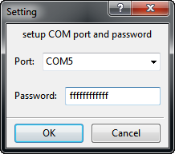

## What is LibSC Reader Kit

[LibSC Card Reader Module Development Kit](https://www.javacardos.com/store/libsc-reader-kit.php?ws=github&prj=LibSC_Reader_Kit) developed by [JavaCardOS Technologies](https://www.javacardos.com/about/?ws=github&prj=LibSC_Reader_Kit) is based on Arduino MFRC522-1.2.0 library source code. It has been further encapsulated and its functions has also been enhanced as well, which makes it much closer to a universal card reader's function. 

Combined with the card provided by JavaCardOS, you can directly send control commands from PC to communicate with the reader and then read/write the card infomation.It expands the new command control channel while retaining the original printout function, which greatly facilitates the 14443 communication protocol learning  process.

The entire suite of hardware is carefully chosen, tested and integrated by JavaCardOS, and can be also used as a cost-effective business solution. In addition, each component of this kit can be individually purchased in batches, please feel free to contact [JavaCardOS](mailto:javacardos@gmail.com).

## List of Components

- arduino UNO R3 board
- MFRC522 antenna board
- 1 * 8 Pin Header Strip（for MFRC522 board）
- 1 * 8 Pin Header Strip（bending socket for MFRC522 board）
- Dupont wire * 7
- USB cable * 1
- MIFARE 1k card(Please note that this is not the cloneable card, if you need MIFARE clone 1k card, please click [here](https://www.javacardos.com/store/mifare-clone-1k.php?ws=github&prj=LibSC_Reader_Kit) )

 
LibSC Reader Kit pro includes a Mifare Clone 1K and a CPU card. You can send APDU commands via LibSC Reader.If you need enhanced version of the suite, please click [here](https://www.javacardos.com/store/libsc-reader-kit-pro.php?ws=github&prj=LibSC_Reader_Kit)

## Architecture

  

The content in the dotted box is the software code implementation on PC, such as all the scripts and LibSC API implementation.All these codes will be executed on PC.There are also two arrows,which indicate *PORT A* and *PORT B*. The *PORT A* is connected with USB cable.Although we just see an USB cable ,essentially,the USB device is virtual as a serial device to access to the computer.The *PORT B* indicates the dupont wires, which connnect arduino core board and MFRC522.The firmware code is downloaded to core board via USB, so you will see that the source code of this kit is divided to two directories, that is [Client](./src/Client)(PC-side code) and [Firmware](./src/Firmware)( firmware code that will be downloaded to arduino core board).

## Quick Start 
1.Install arduino [development environment](https://www.javacardos.com/javacardforum/viewtopic.php?f=19&t=1352&p=4348#p4348).  
2.Install serial device driver .
  &nbsp;&nbsp;&nbsp;Please download the cooresponding driver according to your platform and requirement.  
  &nbsp;&nbsp;&nbsp;[windows](https://www.javacardos.com/javacardforum/viewtopic.php?f=19&t=1352&p=4437#p4437)  
  &nbsp;&nbsp;&nbsp;[linux](https://www.javacardos.com/javacardforum/viewtopic.php?f=19&t=1352&p=4437#p4437)  
  &nbsp;&nbsp;&nbsp;[mac](https://www.javacardos.com/javacardforum/viewtopic.php?f=19&t=1352&p=4437#p4437)  
3.Please refer to [this picture](./img/Arduino-Uno-r3-with-RFID-RC522.png) to connect each component.   
4.Install [MFRC522 library](https://drive.google.com/file/d/0BzXJhN5FPrE5Zkd4V3pySVN4X0k/view) .   
5.Add LibSC Reader implementation [firmware code](./src/Firmware) to MFRC522 library installation directory.    
6.Download firmware code to arduino hardware.   
7.Install pyserial .
&nbsp;&nbsp;&nbsp;`pip install pyserial`  
8.Run LibSC Reader [client code](./src/Client) to confirm whether the smart card reader can work.

## Install Arduino Development Environment  
  &nbsp;&nbsp;&nbsp;Support arduino 1.6,1.7,1.8 or above. If you have any question, please post it in the [forum](https://www.javacardos.com/javacardforum/?ws=github&prj=LibSC_Reader_Kit).  

  &nbsp;&nbsp;&nbsp;Double-click arduino-1.8.0-windows.exe, click "I Agree"  and then continue the following installation step.   
  &nbsp;&nbsp;&nbsp;  
  &nbsp;&nbsp;&nbsp;  
  &nbsp;&nbsp;&nbsp;  
  &nbsp;&nbsp;&nbsp;    
  &nbsp;&nbsp;&nbsp;Click "close" to finish the installation.
  
## Install Serial Device Driver(windows) 
&nbsp;&nbsp;&nbsp;If using ch340 series chip as the USB virtual serial chip of the current arduino board sold in our online store, it also needs a additional driver installation process. Then you are able to communicate with arduino core board via USB cable.  

### Driver Installation Steps
&nbsp;&nbsp;&nbsp;1.Download [CH341SER.zip](https://www.javacardos.com/javacardforum/viewtopic.php?f=19&t=1352&p=4348#p4348),   and decompress.  
&nbsp;&nbsp;&nbsp;2.Insert the device.  
&nbsp;&nbsp;&nbsp;3.Specify where the driver is located.

#### Install Driver Manually(Exception Handling)
&nbsp;&nbsp;&nbsp;If the driver can not be recognized or encountering error during the installation process, you can follow the steps below to manually install the driver.Open the device manager and select "Other devices" or "Ports".
&nbsp;&nbsp;&nbsp;If device driver is not installed properly, just as the following figure shows.  
&nbsp;&nbsp;&nbsp;  

&nbsp;&nbsp;&nbsp;Please select "Update Driver Software".  
&nbsp;&nbsp;&nbsp;  

&nbsp;&nbsp;&nbsp;In the new pop-up dialog box, select "Browse my computer for driver software".  
&nbsp;&nbsp;&nbsp;  

&nbsp;&nbsp;&nbsp;The entered path should be the driver decompression path.  
&nbsp;&nbsp;&nbsp;  

&nbsp;&nbsp;&nbsp;After the installation is completed, the below dialog box will pop-up.  
&nbsp;&nbsp;&nbsp;  

&nbsp;&nbsp;&nbsp;If the driver works normally, you will see this device in the device manager, as shown below.  
&nbsp;&nbsp;&nbsp;  

## Connect components  
&nbsp;&nbsp;&nbsp;Please refer to the following picture to complete the connection.  
&nbsp;&nbsp;&nbsp;  

&nbsp;&nbsp;&nbsp;Note:  
&nbsp;&nbsp;&nbsp;SDA------------------------Digital 10  
&nbsp;&nbsp;&nbsp;SCK------------------------Digital 13  
&nbsp;&nbsp;&nbsp;MOSI----------------------Digital 11  
&nbsp;&nbsp;&nbsp;MISO----------------------Digital 12  
&nbsp;&nbsp;&nbsp;IRQ------------------------unconnected  
&nbsp;&nbsp;&nbsp;GND-----------------------GND  
&nbsp;&nbsp;&nbsp;RST------------------------Digital 9  
&nbsp;&nbsp;&nbsp;3.3V------------------------3.3V (DO NOT CONNECT TO 5V)  

You can also refer to [this article](
https://javacardos.com/tools/index.html?app=jcide&adurl=https://create.arduino.cc/projecthub/Aritro/security-access-using-rfid-reader-f7c746) from Arduino official website.
If you want to view the real pictures of wire connection ,please click[ here](./img/mifare.png).

## Install MFRC522 Library  
&nbsp;&nbsp;&nbsp;Decompress MFRC522-1.2.0.zip and copy the content to X:\***\Arduino\libraries  

&nbsp;&nbsp;&nbsp;`e.g. D:\Program Files (x86)\Arduino\libraries`  
  
##Add LibSC Reader Implemention Code  
&nbsp;&nbsp;&nbsp;Copy all the content of src\Firmware to X:\***\Arduino\libraries\MFRC522  
&nbsp;&nbsp;&nbsp;`e.g. D:\Program Files (x86)\Arduino\libraries\MFRC522`  

## Download Firmware to Arduino Hareware  
&nbsp;&nbsp;&nbsp;1.Open D:\Program Files (x86)\Arduino\libraries\MFRC522\examples\LibSC_RF_ReaderEx\LibSC_RF_ReaderEx.ino
&nbsp;&nbsp;&nbsp;2.Compile and download, click Verify and Upload button.  

note:If failed to compile or upload, you can switch the port(the coresponding port mentioned above) by the arduino development environment menu *tools->port*. 

## Install pyserial 
&nbsp;&nbsp;&nbsp;Please install python and pip before installing pyserial.
Enter the command below in the console to install pyserial, then you can communicate with  arduino core board via serial port.  
&nbsp;&nbsp;&nbsp;`pip install pyserial`

## Run LibSC Reader
 
### How to place the card  
&nbsp;&nbsp;&nbsp;The shape of antenna board(MFRC522) is a little small,so when the card antenna is bigger than it, the placement angle has an effect on the stability of the connection. Please refert o the pictures shown below to properly place the card.  
  
&nbsp;&nbsp;&nbsp;Mifare Card  
&nbsp;&nbsp;&nbsp;  

&nbsp;&nbsp;&nbsp;CPU Card  
&nbsp;&nbsp;&nbsp;  

### Test Card
  &nbsp;&nbsp;&nbsp;Click arduino menu *Tools->Port "COMXX" * to check COM port information.  
  &nbsp;&nbsp;&nbsp;  
#### Console mode verification
  &nbsp;&nbsp;&nbsp;Open the console, switch to the directory src/client and execute the below command  
  &nbsp;&nbsp;&nbsp;`LibSC_Client.py com12`
  &nbsp;&nbsp;&nbsp;"com12" is the port number assigned by the system.The port number will be different on different computers.  
  &nbsp;&nbsp;&nbsp;If the card placed on the card reader module is MIFARE card, you will get the logs similar as the following.  
  &nbsp;&nbsp;&nbsp;[MIFARE test log](./log/mifare.log)  
  &nbsp;&nbsp;&nbsp;If the card placed on the card reader module is CPU card, you will get the logs similar as the following.  
  &nbsp;&nbsp;&nbsp;[CPU card test log](./log/cpucard.log)  
#### Clone a MIFARE card by LibSC_tools  

  LibSC_tools is a GUI program, which is developed based on wxPython.You can implement some basic operations on MIFARE card or MIFARE CLONE card via this program.
 

  Please install [wxPython3.0-win64-3.0.2.0-py27.exe](https://drive.google.com/drive/folders/0BzXJhN5FPrE5QWU5UURVWHdqajA) in advance before using the program. And also remember to select the installation version according to your own system.
##### Start program
Put the card,which is to be copied, to the effective position of 
MFRC522 antenna. Start program and execute "LibSC_Tools.py" in the console.Then enter COM port and MIFARE sector password.   
   
After selecting the corresponding port, click "OK" to jump to program main interface. In the new dialogbox, you can see the current card type according to the item "Card Type" and it will also shows whether the card is cloneable.    
    
Currently we only provide  *Read Card* function and *CopyUID* function. The *Write Card* function is not available. You can modify the source code (./src) according to your own requirement. Note: The *Write Card* function can cause the card irremediable defect. Please look through  the content of chapter Password and Permission in MIFARE manual. 
##### Copy UID  
Click "CopyUID" to copy the UID of the current connected card. Then the following dialogbox will display and the program will be back to the state that no cards are connected.At this time, you can change the card that supports CLONE function.   
   
##### Write UID  
After "CopyUID" operation ,the button's label "CopyUID" will be changed to "WriteUID" automatically,click  "WriteUID" to write the copied UID to the target card.
If the target card can not support CLONE function, the following dialogbox will display.  
  
If the target card support CLONE function, the pop-up dialog box will  let you confirm the "WriteUID" operation.   
  

# Discussion  
  &nbsp;&nbsp;&nbsp;If you have any problem on LibSC Reader Module Development Kit, please feel free to post them in our forum. [JavaCardOS DISCUSSION](https://javacardos.com/javacardforum/viewtopic.php?f=19&t=1352?ws=github&prj=LibSC_Reader_Kit)

# TODO
    Verify the below platforms:
        arduino mega256
        arduino mini
        arduino micro
